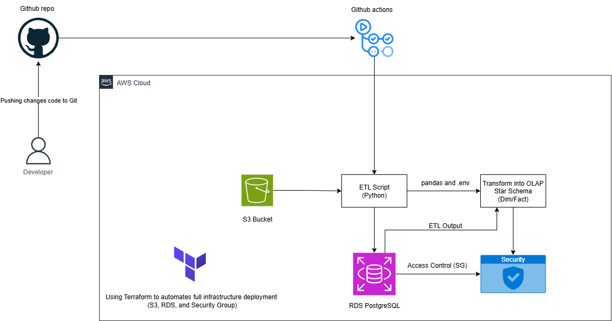

# Cloud ETL Pipeline: CSV to OLAP on AWS
A production-ready ETL pipeline that extracts data from CSV files in Amazon S3, transforms it using Pandas, and loads it into a star schema hosted on Amazon RDS PostgreSQL. The project includes full CI/CD automation with GitHub Actions and uses Terraform for infrastructure deployment.

## Architecture

## Features
- Upload and manage CSVs in S3
- Transform data using Pandas to fit a Star Schema
- Load into PostgreSQL (RDS)
- Infrastructure-as-Code with Terraform
- Auto-deploy ETL updates with GitHub Actions
- Secure networking with AWS Security Groups

## Star Schema Overview

### OLAP Star Schema

The following tables are loaded into PostgreSQL:
- `customer_dim`
- `product_dim`
- `transaction_dim`
- `country_dim`
- `date_dim`
- `sales_fact`

These follow a classic star schema structure for analytics-ready querying.

## Future Improvements
- Add data validation & error handling
- Automate daily ETL using Lambda or EventBridge
- Add test coverage (pytest or Great Expectations)
- Integrate with visualization (e.g., QuickSight or Metabase)
